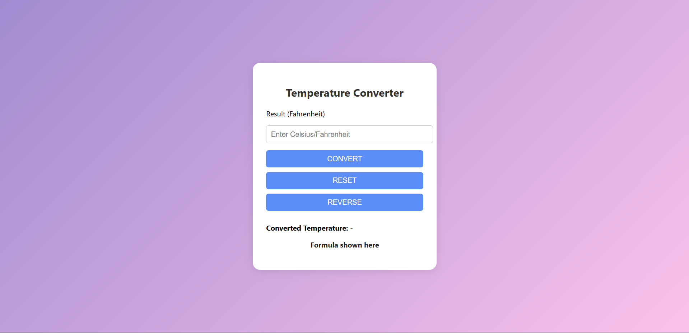

# 🌡️ Temperature Converter Web App

A simple and clean web application to convert temperatures between Celsius and Fahrenheit, built with HTML, CSS, and JavaScript.

## 🚀 Features

- Convert between Celsius and Fahrenheit
- Reset and reverse functionality
- Responsive and modern UI design
- Clean code and easy to understand

## 📸 Preview



## 🌈 Tech Stack

- **HTML** - Markup structure
- **CSS** - Styling and layout
- **JavaScript** - Logic and interactivity

## 💡 How to Use

1. Clone this repository:

   ```bash
   git clone https://github.com/revou-fundamental-course/19-may-25-Imaderexy.git
   
